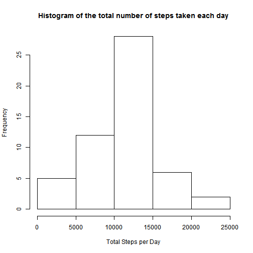
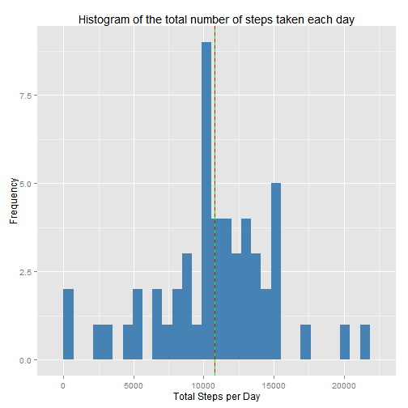
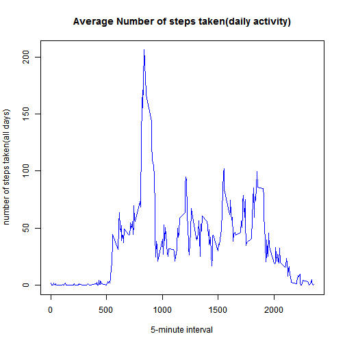
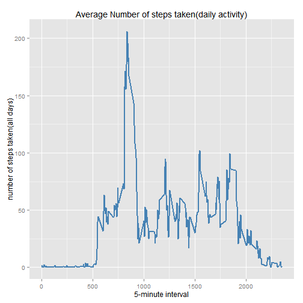
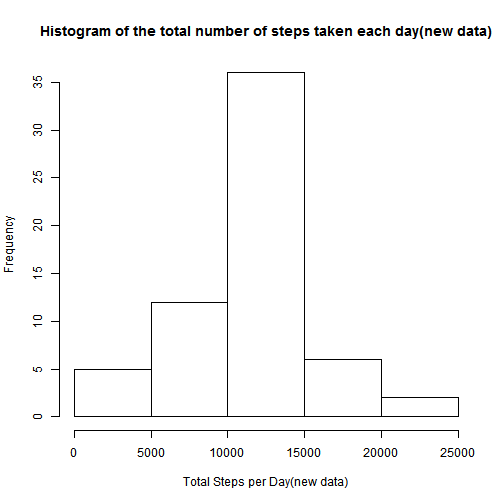
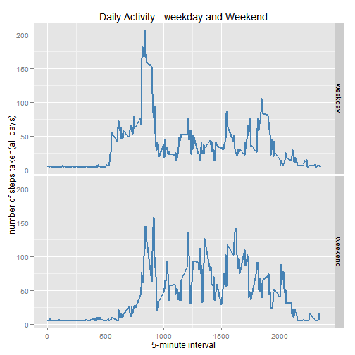

# Reproducible Research: Peer Assessment 1
It is now possible to collect a large amount of data about personal movement using activity monitoring devices such as a Fitbit, Nike Fuelband, or Jawbone Up. These type of devices are part of the ¡°quantified self¡± movement ??? a group of enthusiasts who take measurements about themselves regularly to improve their health, to find patterns in their behavior, or because they are tech geeks. But these data remain under-utilized both because the raw data are hard to obtain and there is a lack of statistical methods and software for processing and interpreting the data.

This assignment makes use of data from a personal activity monitoring device. This device collects data at 5 minute intervals through out the day. The data consists of two months of data from an anonymous individual collected during the months of October and November, 2012 and include the number of steps taken in 5 minute intervals each day.


## 1. Loading and preprocessing the data
### Show any code that is needed to 

### 1) Load the data (i.e. `read.csv()`) 

### 2) Process/transform the data (if necessary) into a format suitable for your analysis

### Loading and preprocessing

```r
### loading source data
fileUrl <- "https://d396qusza40orc.cloudfront.net/repdata%2Fdata%2Factivity.zip"
if(!file.exists("./data")){dir.create("./data")}
zipFile <- "./data/activity.zip"    #name zip file
if (!file.exists(zipFile)) {
        download.file(Url, destfile = zipFile)
}

### unzip and check the inside
unzip(zipFile, exdir="./data")
rawAct <- read.csv("./data/activity.csv") 

dim(rawAct)
```

```
## [1] 17568     3
```

```r
str(rawAct)
```

```
## 'data.frame':	17568 obs. of  3 variables:
##  $ steps   : int  NA NA NA NA NA NA NA NA NA NA ...
##  $ date    : Factor w/ 61 levels "2012-10-01","2012-10-02",..: 1 1 1 1 1 1 1 1 1 1 ...
##  $ interval: int  0 5 10 15 20 25 30 35 40 45 ...
```

```r
summary(rawAct)
```

```
##      steps               date          interval   
##  Min.   :  0.0   2012-10-01:  288   Min.   :   0  
##  1st Qu.:  0.0   2012-10-02:  288   1st Qu.: 589  
##  Median :  0.0   2012-10-03:  288   Median :1178  
##  Mean   : 37.4   2012-10-04:  288   Mean   :1178  
##  3rd Qu.: 12.0   2012-10-05:  288   3rd Qu.:1766  
##  Max.   :806.0   2012-10-06:  288   Max.   :2355  
##  NA's   :2304    (Other)   :15840
```

```r
### processing the  data 
library(ggplot2)
act <- read.csv("./data/activity.csv", header=TRUE, 
                colClasses = c("numeric", "character", "numeric"))
act$date <- as.Date(act$date, format = "%Y-%m-%d")
act$interval <- factor(act$interval)
str(act)
```

```
## 'data.frame':	17568 obs. of  3 variables:
##  $ steps   : num  NA NA NA NA NA NA NA NA NA NA ...
##  $ date    : Date, format: "2012-10-01" "2012-10-01" ...
##  $ interval: Factor w/ 288 levels "0","5","10","15",..: 1 2 3 4 5 6 7 8 9 10 ...
```

```r
summary(act)
```

```
##      steps            date               interval    
##  Min.   :  0.0   Min.   :2012-10-01   0      :   61  
##  1st Qu.:  0.0   1st Qu.:2012-10-16   5      :   61  
##  Median :  0.0   Median :2012-10-31   10     :   61  
##  Mean   : 37.4   Mean   :2012-10-31   15     :   61  
##  3rd Qu.: 12.0   3rd Qu.:2012-11-15   20     :   61  
##  Max.   :806.0   Max.   :2012-11-30   25     :   61  
##  NA's   :2304                         (Other):17202
```


## 2. What is mean total number of steps taken per day?
### For this part of the assignment, you can ignore the missing values in the dataset.

### 1) Make a histogram of the total number of steps taken each day

### using base

```r
### histogram of the total number of steps tabke each day
stepsDay <- aggregate(steps ~ date, act, sum)
head(stepsDay)
```

```
##         date steps
## 1 2012-10-02   126
## 2 2012-10-03 11352
## 3 2012-10-04 12116
## 4 2012-10-05 13294
## 5 2012-10-06 15420
## 6 2012-10-07 11015
```

```r
hist(stepsDay$steps, xlab = "Total Steps per Day", 
     ylab = "Frequency",
     main ="Histogram of the total number of steps taken each day"
     )
```

 


### using ggplot2 (another way)

```r
### histogram of the total number of steps tabke each day
library(ggplot2)
stepsDay <- aggregate(steps ~ date, act, sum)
g <- ggplot(stepsDay, aes(x = steps)) 
g + geom_histogram(fill = "steelblue", binwidth = 5000) + labs(x="Total Steps per Day")+ labs(y="Frequency") + labs(title ="Histogram of the total number of steps taken each day") 
```

 


### 2) Calculate and report the mean and median total number of steps taken per day


```r
### Mean and Median 
stepsMeanDay <- round(mean(stepsDay$steps), 2)
stepsMdianDay <- round(median(stepsDay$steps), 2)
```

***The mean number of steps taken per day is 1.0766 &times; 10<sup>4</sup> and the median number of steps taken per day is 1.0765 &times; 10<sup>4</sup> .***


## 3. What is the average daily activity pattern?
### 1) Make a time series plot (i.e. type = "l") of the 5-minute interval (x-axis) and the average number of steps taken, averaged across all days (y-axis)

### using base 

```r
### average number of steps taken, aveaged cross all day
stepsInterval <- aggregate(steps ~ interval, data = act, FUN=mean, na.rm = TRUE)
#change interval(factor) to interval(integer)
str(stepsInterval)
```

```
## 'data.frame':	288 obs. of  2 variables:
##  $ interval: Factor w/ 288 levels "0","5","10","15",..: 1 2 3 4 5 6 7 8 9 10 ...
##  $ steps   : num  1.717 0.3396 0.1321 0.1509 0.0755 ...
```

```r
stepsInterval$interval <- as.integer(levels(stepsInterval$interval)[stepsInterval$interval])
str(stepsInterval)
```

```
## 'data.frame':	288 obs. of  2 variables:
##  $ interval: int  0 5 10 15 20 25 30 35 40 45 ...
##  $ steps   : num  1.717 0.3396 0.1321 0.1509 0.0755 ...
```

```r
plot(steps ~ interval, data = stepsInterval, type = "l", 
     xlab = "5-minute interval", 
     ylab = "number of steps taken(all days)",
     main = "Average Number of steps taken(daily activity)",
     col = "blue")
```

 
?levels
stepsInterval
### using ggplot (another way)

```r
stepsInterval <- aggregate(steps ~ interval, data = act, FUN=mean, na.rm = TRUE)
# change interval(factor) to interval(integer)
str(stepsInterval)
```

```
## 'data.frame':	288 obs. of  2 variables:
##  $ interval: Factor w/ 288 levels "0","5","10","15",..: 1 2 3 4 5 6 7 8 9 10 ...
##  $ steps   : num  1.717 0.3396 0.1321 0.1509 0.0755 ...
```

```r
stepsInterval$interval <- as.integer(levels(stepsInterval$interval)[stepsInterval$interval])
str(stepsInterval)
```

```
## 'data.frame':	288 obs. of  2 variables:
##  $ interval: int  0 5 10 15 20 25 30 35 40 45 ...
##  $ steps   : num  1.717 0.3396 0.1321 0.1509 0.0755 ...
```

```r
g2 <- ggplot(stepsInterval, aes(x=interval, y=steps, group=1)) 
g2 + geom_line(color = "steelblue", size = 1) + labs(title = "Average Number of steps taken(daily activity)") + labs(x = "5-minute interval") + labs(y = "number of steps taken(all days)") 
```

 


### 2) Which 5-minute interval, on average across all the days in the dataset, contains the maximum number of steps?


```r
maxNum <- which.max(stepsInterval$steps)
maxSteps <- stepsInterval$steps[maxNum]
maxInterval <- stepsInterval$interval[maxNum]
```

***Maximum number of steps on average across all the days is 206.1698 steps, and Maximum activity is 835th interval.***


## 4. Imputing missing values
### Note that there are a number of days/intervals where there are missing values (coded as NA). The presence of missing days may introduce bias into some calculations or summaries of the data.

### 1) Calculate and report the total number of missing values in the dataset (i.e. the total number of rows with NAs)


```r
### total number of rows with NAs 
NAsum <- sum(is.na(act))
```

The total number of missing values in the datatset is 2304 rows. 

### 2) Devise a strategy for filling in all of the missing values in the dataset. The strategy does not need to be sophisticated. For example, you could use the mean/median for that day, or the mean for that 5-minute interval, etc.


```r
### replace NAs
act$steps2 = act$steps
for (i in 1:length(act$steps)) {
        if (is.na(act$steps[i])) {
                act$steps2[i] = mean(act$steps, na.rm = TRUE)
        }
}
head(act)
```

```
##   steps       date interval steps2
## 1    NA 2012-10-01        0  37.38
## 2    NA 2012-10-01        5  37.38
## 3    NA 2012-10-01       10  37.38
## 4    NA 2012-10-01       15  37.38
## 5    NA 2012-10-01       20  37.38
## 6    NA 2012-10-01       25  37.38
```


### 3) Create a new dataset that is equal to the original dataset but with the missing data filled in.


```r
newAct = data.frame(steps = act$steps2, date = act$date, interval = act$interval)
head(newAct)
```

```
##   steps       date interval
## 1 37.38 2012-10-01        0
## 2 37.38 2012-10-01        5
## 3 37.38 2012-10-01       10
## 4 37.38 2012-10-01       15
## 5 37.38 2012-10-01       20
## 6 37.38 2012-10-01       25
```


### 4) Make a histogram of the total number of steps taken each day and Calculate and report the mean and median total number of steps taken per day. Do these values differ from the estimates from the first part of the assignment? What is the impact of imputing missing data on the estimates of the total daily number of steps?


```r
### histogram(new data) 
stepsDayNew <- aggregate(steps ~ date, data=newAct, sum, na.rm=TRUE)
hist(stepsDayNew$steps, xlab = "Total Steps per Day(new data)",
     ylab = "Frequency",
     main = "Histogram of the total number of steps taken each day(new data)")
```

 

```r
### mean and median
meanStepsDayNew <- mean(stepsDayNew$steps)
medianStepsDayNew <- median(stepsDayNew$steps)
```

***The mean of total number of steps taken per day(new data) is 1.0766 &times; 10<sup>4</sup>.***
***The median of total number of steps taken per day(new data) is 1.0766 &times; 10<sup>4</sup>.***


***Comparing with the first part of the assignment, mean value is not chanaged and median value has shifted a little.*** 


## 5. Are there differences in activity patterns between weekdays and weekends?
### For this part the weekdays() function may be of some help here. Use the dataset with the filled-in missing values for this part.

### 1. Create a new factor variable in the dataset with two levels ??? ¡°weekday¡± and ¡°weekend¡± indicating whether a given date is a weekday or weekend day.

### 2. Make a panel plot containing a time series plot (i.e. type = "l") of the 5-minute interval (x-axis) and the average number of steps taken, averaged across all weekday days or weekend days (y-axis). The plot should look something like the following, which was creating using simulated data:


```r
### time seting
Sys.setlocale("LC_TIME", "C")
```

```
## [1] "C"
```

```r
### serperating weekday and weekend 
newAct$weekday <- as.factor(weekdays(newAct$date))
head(newAct)
```

```
##   steps       date interval weekday
## 1 37.38 2012-10-01        0  Monday
## 2 37.38 2012-10-01        5  Monday
## 3 37.38 2012-10-01       10  Monday
## 4 37.38 2012-10-01       15  Monday
## 5 37.38 2012-10-01       20  Monday
## 6 37.38 2012-10-01       25  Monday
```

```r
newActWeekend <- subset(newAct, weekday %in% c("Saturday", "Sunday"))
newActWeekday <- subset(newAct, !weekday %in% c("Saturday", "Sunday"))

# new column "sepDay" (weekend and weekday)
newActWeekend$sepDay <- rep("weekend", nrow(newActWeekend))
newActWeekday$sepDay <- rep("weekday", nrow(newActWeekday))
head(newActWeekend)
```

```
##      steps       date interval  weekday  sepDay
## 1441     0 2012-10-06        0 Saturday weekend
## 1442     0 2012-10-06        5 Saturday weekend
## 1443     0 2012-10-06       10 Saturday weekend
## 1444     0 2012-10-06       15 Saturday weekend
## 1445     0 2012-10-06       20 Saturday weekend
## 1446     0 2012-10-06       25 Saturday weekend
```

```r
head(newActWeekday)
```

```
##   steps       date interval weekday  sepDay
## 1 37.38 2012-10-01        0  Monday weekday
## 2 37.38 2012-10-01        5  Monday weekday
## 3 37.38 2012-10-01       10  Monday weekday
## 4 37.38 2012-10-01       15  Monday weekday
## 5 37.38 2012-10-01       20  Monday weekday
## 6 37.38 2012-10-01       25  Monday weekday
```

```r
### make one new final data set and calcurate the mean 
newActSepDay <- rbind(newActWeekday, newActWeekend)

# average number of steps taken, averaged across all weekday days or weekend days
newActSepDayPerDay <- aggregate(steps ~ interval + sepDay, data = newActSepDay, FUN = mean, na.rm = T)


### graph
# change factor to integer 
newActSepDayPerDay$interval <- as.integer(levels(newActSepDayPerDay$interval)[newActSepDayPerDay$interval])

# using ggplot2
g3 <- ggplot(newActSepDayPerDay, aes(x=interval, y=steps))
g3 + geom_line(color="steelblue", size=1) + facet_grid(sepDay~.) + labs(x = "5-minute interval") + labs(y= "number of steps taken(all days)") + labs(title = "Daily Activity - weekday and Weekend")
```

 

```r
Sys.setlocale("LC_TIME")
```

```
## [1] "Korean_Korea.949"
```


